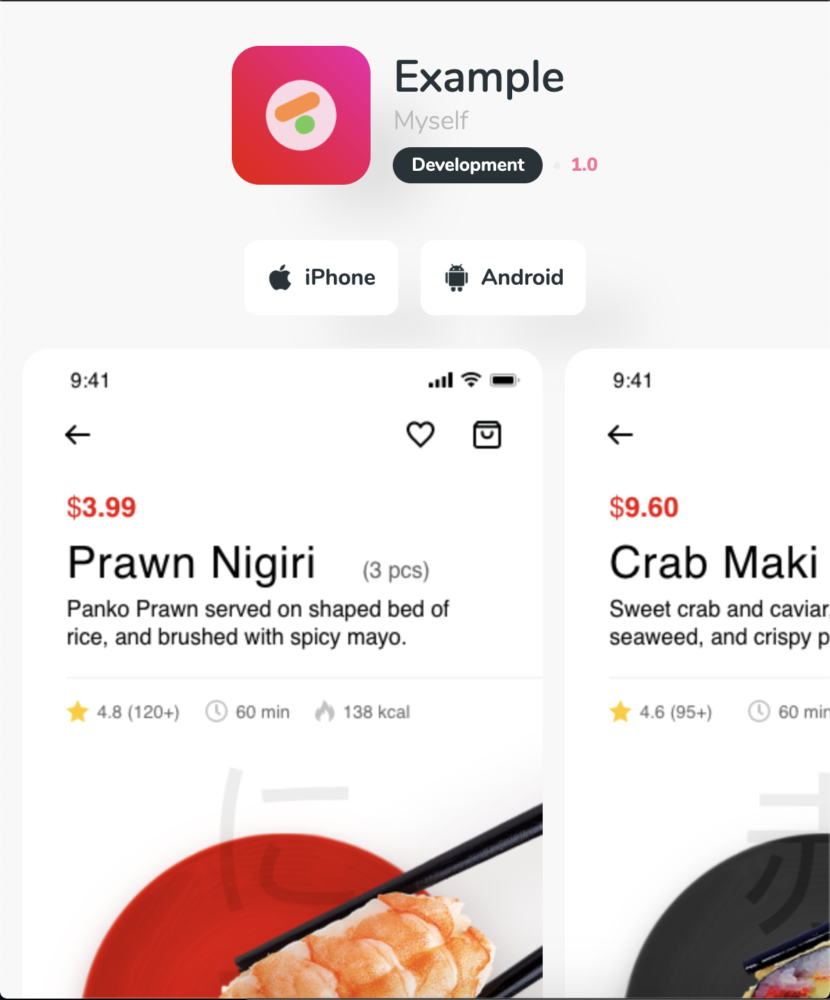

<h1 align="center">
  Download Mobile App Template
</h1>


## 🚀 How to

## 0. **Preview**



## 1. **Development**

Create an environment file with the following content:
```env
IDENTIFIER=com.example.app.development
HOST=https://example.com
SCREENS_COUNT=7
TITLE=Example
VERSION=1.0
```

## 2. **Production**

Execute the following commands

```bash
# Create a Docker network 'local'
sudo docker network create local

# Copy the compose folder
cp -r compose docker

# Edit docker/config.env file with the corresponding values
# ... vim docker/config.env ....
# For example, if you have 7 screens, set SCREENS_COUNT to 7
# Put screenshot_0.png, ..., screenshot_6.png into files/
# Put app.ipa and app.apk into files/
# Put icon.png into files/

# Build the static public folder
sudo docker-compose -f docker/build/docker-compose build
sudo docker-compose -f docker/build/docker-compose up

# Serve the static folder
sudo docker-compose -f docker/serve/docker-compose up -d
```

## 3. **Credits**

Screenshots have been downloaded from this template:
[Sushi restaurant App concept for Adobe XD](https://www.xdguru.com/sushi-restaurant-app-concept-for-xd/)